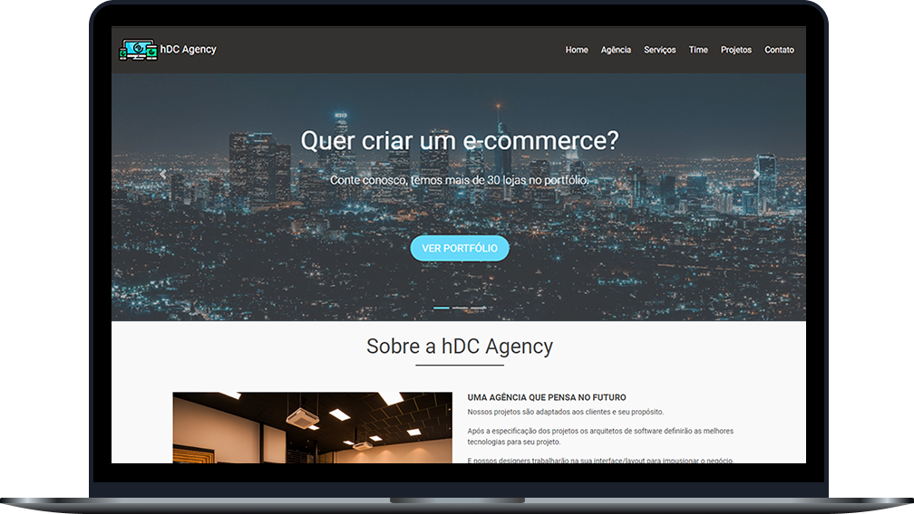

# 💻 Projeto-hDC
 Durante o curso de Bootstrap 4, aplicado pelo canal Hora de Codar no Youtube, foi implementado algumas funções do framework para criação de um site de uma agência fictícia. Feito para a capacitação de tecnologias da byron.solutions.

**Visualização da página principal:**

  

**Tecnologias utilizadas:**
 - Html
- Css
- Javascript (Jquery)
- Bootstrap 4

**Conhecendo um novas aplicações:**
 - Carousel: Um slideshow para fazer um giro nas imagens com títulos e parágrafos.
 - Scroll Animado: Ao clicar nas opções da barra de navegação (home, agência) a página vai até a seção desejada.
 - Parallax: Uma imagem de fundo com impressão de movimento.